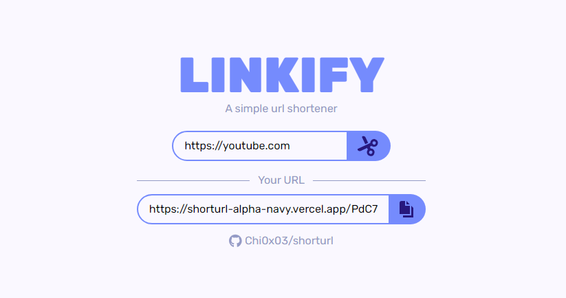

# LINKIFY

---

### Encurtador de links

Linkify é um simples encurtador de link. Feito utilizando as tecnologias:
- Next.js
- React
- Tailwind
- Vercel Postgres
- Vercel

Ele cria URLs de 4 caracteres, permitindo a possibilidade de criação de $64^4$ links (aproximadamente 16 milhões de URLs).